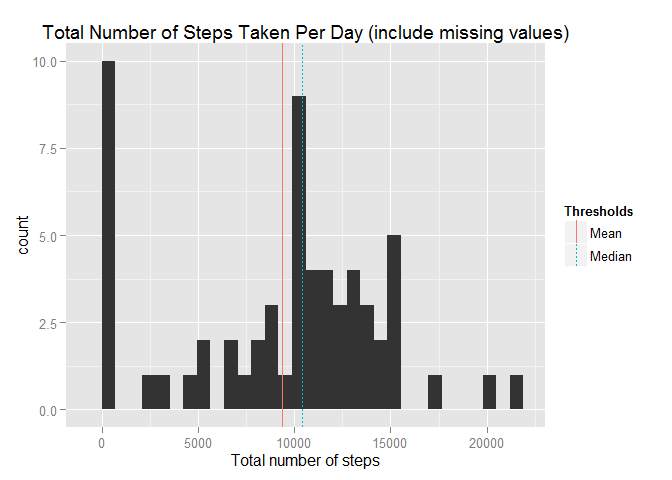
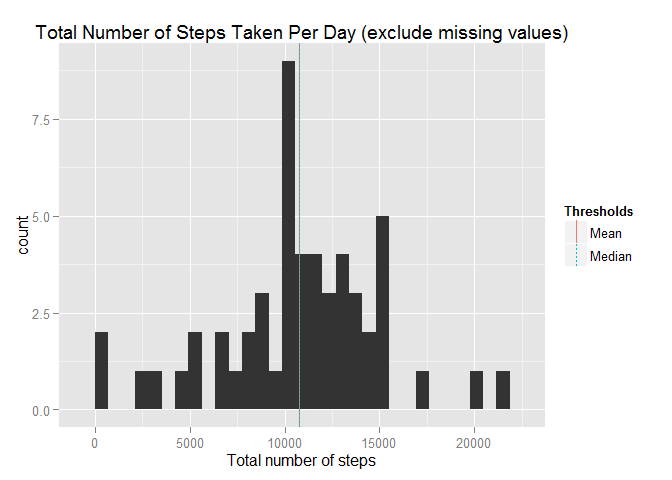
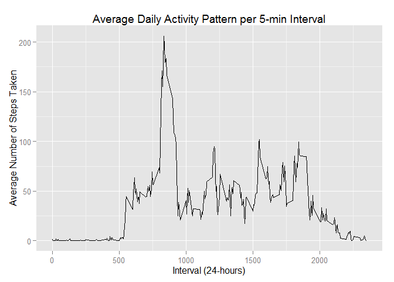
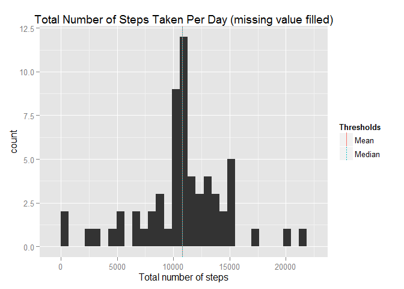
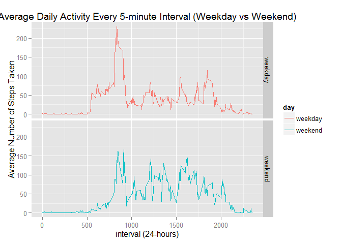

# Reproducible Research: Peer Assessment 1


## 1. Loading and preprocessing the data


The data can be downloaded from https://d396qusza40orc.cloudfront.net/repdata%2Fdata%2Factivity.zip


```r
#Ensure you have installed knitr and ggplot2 before starting analysis
library(knitr)
library(plyr)
library(ggplot2)

#Change to right working directory
setwd("D:/DataScience/Coursera/RepData_PeerAssessment1")

#Load activity data
activity <- read.csv("./data/activity.csv", header = TRUE)

activity$date <- as.Date(as.character(activity$date))

summary(activity)
```

```
##      steps             date               interval     
##  Min.   :  0.00   Min.   :2012-10-01   Min.   :   0.0  
##  1st Qu.:  0.00   1st Qu.:2012-10-16   1st Qu.: 588.8  
##  Median :  0.00   Median :2012-10-31   Median :1177.5  
##  Mean   : 37.38   Mean   :2012-10-31   Mean   :1177.5  
##  3rd Qu.: 12.00   3rd Qu.:2012-11-15   3rd Qu.:1766.2  
##  Max.   :806.00   Max.   :2012-11-30   Max.   :2355.0  
##  NA's   :2304
```


## 2. What is mean total number of steps taken per day?
This analysis first examines the mean total number of steps taken per day, with the missing values included.


From the histogram, mean value (red line) is lower than median value (dashed blue line) because there are days where 0 step is recorded.


```r
stepsPerDayNA <- ddply(activity, "date", summarize, totalSteps = sum(steps, na.rm=T))

cuts1 <- data.frame(Thresholds = "Mean", vals = mean(stepsPerDayNA$totalSteps))
cuts2 <- data.frame(Thresholds = "Median", vals = median(stepsPerDayNA$totalSteps))
cuts <- rbind(cuts1, cuts2)

ggplot(data = stepsPerDayNA, aes(x = stepsPerDayNA$totalSteps)) + geom_histogram() + 
  geom_vline(data=cuts, aes(xintercept=vals, linetype=Thresholds, colour=Thresholds), show_guide = TRUE) +
  xlab("Total number of steps") + ggtitle("Total Number of Steps Taken Per Day (include missing values)")
```

 

Below calculation shows mean and median total number of steps per day.

```r
mean(stepsPerDayNA$totalSteps)
```

```
## [1] 9354.23
```

```r
median(stepsPerDayNA$totalSteps)
```

```
## [1] 10395
```

Another analysis I have done is by excluding missing values in the dataset.

```r
stepsPerDay <- ddply(activity, "date", summarise, totalSteps = sum(steps))

cuts1 <- data.frame(Thresholds="Mean", vals=mean(stepsPerDay$totalSteps, na.rm=T))
cuts2 <- data.frame(Thresholds="Median", vals=median(stepsPerDay$totalSteps, na.rm=T))
cuts <- rbind(cuts1, cuts2)

ggplot(data=stepsPerDay, aes(x=stepsPerDay$totalSteps)) + geom_histogram() +
  geom_vline(data=cuts, aes(xintercept=vals, linetype=Thresholds, colour=Thresholds), show_guide=TRUE) +
  xlab("Total number of steps") + ggtitle("Total Number of Steps Taken Per Day (exclude missing values)")
```

 

Below calculation shows mean and median total number of steps per day.

```r
mean(stepsPerDay$totalSteps, na.rm=T)
```

```
## [1] 10766.19
```

```r
median(stepsPerDay$totalSteps, na.rm=T)
```

```
## [1] 10765
```


## 3. What is the average daily activity pattern?


A time series plot of 5-minute interval (x-axis) and the average number of steps taken, averaged across all days (y-axis) is construted.


```r
intervalavg <- ddply(activity, "interval", summarise, avgSteps = mean(steps, na.rm=T))

ggplot(data=intervalavg, aes(x=intervalavg$interval, y=intervalavg$avgSteps)) + geom_line() +
  ggtitle("Average Daily Activity Pattern per 5-min Interval") + xlab("Interval (24-hours)") +
  ylab("Average Number of Steps Taken")
```

 


Maximum number steps is at interval 835 for 5-minute interval on average across all the days in the dataset

```r
intervalavg[which.max(intervalavg$avgSteps),]
```

```
##     interval avgSteps
## 104      835 206.1698
```

## 4. Imputing missing values


To start with, I will find out total missing values in the dataset (by showing total number of rows with NAs)

```r
table(is.na(activity$steps))
```

```
## 
## FALSE  TRUE 
## 15264  2304
```

The strategy to fill-in missing value is to use average (mean) value of 5-minute interval.

```r
averages <- aggregate(x=list(steps=activity$steps), by=list(interval=activity$interval), mean, na.rm=TRUE)

fill_value <- function(steps, interval) {
    filled <- NA
    if(!is.na(steps))
        filled <- c(steps)
    else
        filled <- averages[intervalavg$interval==interval, "steps"]
    return(filled)
}
activityFilled <- activity
activityFilled$steps <- mapply(fill_value, activityFilled$steps, activityFilled$interval)
```

With the missing value filled with average of 5-minute inverval, a histogram is plotted to show total number of steps taken each day.  The result shows that mean and median of total number of steps taken per day are closed to each other.

```r
stepsPerDayFilled <- ddply(activityFilled, "date", summarise, totalSteps=sum(steps))

cuts1 <- data.frame(Thresholds="Mean", vals=mean(stepsPerDayFilled$totalSteps))
cuts2 <- data.frame(Thresholds="Median", vals=median(stepsPerDayFilled$totalSteps))
cuts <- rbind(cuts1, cuts2)

ggplot(data=stepsPerDayFilled, aes(x=stepsPerDayFilled$totalSteps)) + geom_histogram() +
  geom_vline(data=cuts, aes(xintercept=vals, linetype=Thresholds, colour=Thresholds), show_guide=TRUE) +
  xlab("Total number of steps") + ggtitle("Total Number of Steps Taken Per Day (missing value filled)")
```

 

With the missing value filled, below calculation shows mean and median of total number of steps taken per day

```r
mean(stepsPerDayFilled$totalSteps)
```

```
## [1] 10766.19
```

```r
median(stepsPerDayFilled$totalSteps)
```

```
## [1] 10766.19
```


## 5. Are there differences in activity patterns between weekdays and weekends?


The dataset is added with new factor variable to indicate whether "weekday" or "weekend".

```r
dayofWeek <- ifelse(weekdays(activityFilled$date)=="Saturday" | weekdays(activityFilled$date)=="Sunday", "weekend", "weekday")
activityFilled$day <- as.factor(dayofWeek)

dayActivity <- ddply(activityFilled, c("interval","day"), summarise, avgSteps=mean(steps))
```

A panel plot is constructed for weekday and weekend dataset, with time series plot of 5-minute interval (x-axis) and average number of steps taken (y-axis).

```r
ggplot(dayActivity, aes(interval, avgSteps)) + geom_line(aes(colour=day)) + facet_grid(day ~ .) + 
  ggtitle("Average Daily Activity Every 5-minute Interval (Weekday vs Weekend)") +
  xlab("interval (24-hours)") +
  ylab("Average Number of Steps Taken")
```

 

The comparison shows that during weekday, the user wakes up earlier (at interval of 510) and has maximum steps of 5-minute interval (approximate 265 steps).  This is maybe reflection of user working life pattern which requires user to wake up early and walking to office location.  During normal working hour, user is walking less compared to weekend.


